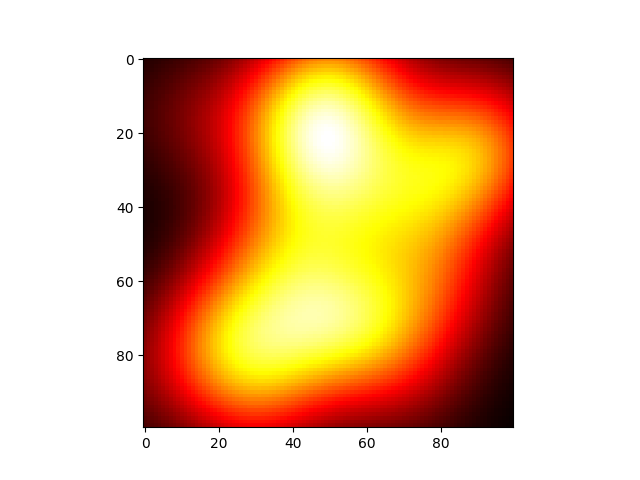
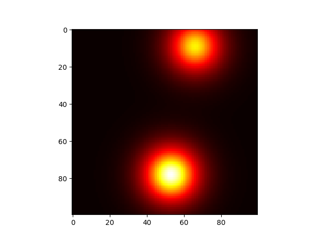

This is a toy example I used to learn the fundementals of active learning. The task is to find the maximum temperature in a room with multiple heat sources. It uses GPytorch to fit the GP to the objective space. In an example, the true heatmap is:

The temperature is multi-modal and has stationary smoothness. The animation below shows the process of active learning to learn the temperature distribution and find the maximum:

 

The algorithm balances exploiting the peaks of the fitted GP with exploring areas with high uncertainty. Note that there is a uniform distribution of test points which is representative of the smoothness of the true function. There are additional points close to the maximum to try to pinpoint it. Given more points, the algorithm would likely further explore the maximum to find further gains.
